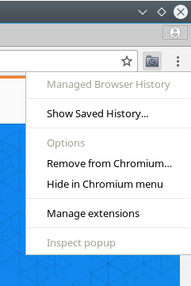
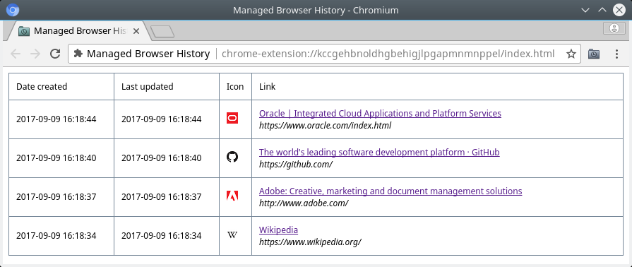

# Как использовать расширение

- Клик на иконке расширения ЛКМ - запомнить страницу.
- Клик на иконке расширения ПКМ → **Show Saved History...** - показать сохраненные закладки.

<kbd></kbd>

<kbd></kbd>

# Структура проекта

Файлы и папки относящиеся непосредственно к расширению для браузера:

- *node_modules/web-store/web-store.js*
- [images/](images/)
- [index.html](index.html)
- [index.js](index.js)
- [background.html](background.html)
- [background.js](background.js)
- [styles.css](styles.css)
- [manifest.json](manifest.json)

# Зависимости

Первая установка:

```bash
$ npm install web-store --save
```

Опция **--save** прописывает зависимость в [package.json](package.json).

Установка зависимостей прописанных в [package.json](package.json):

```bash
$ npm install
```

# Сборка

```bash
$ ./build.sh
```

Результирующий файл: *ManagedBrowserHistory-#.#.#.#.zip*

# Ссылки

- [bash - How to increment version number in a shell script? - Stack Overflow](https://stackoverflow.com/a/17364637/2289640)
- [bash - Modify a key-value in a json using jq - Stack Overflow](https://stackoverflow.com/a/42717073/2289640)
